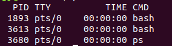

Fuzzing
---
## 实验要求：
- 搜集市面上主要的路由器厂家、在厂家官网中寻找可下载的固件，在 CVE 漏洞数据中查找主要家用路由器厂家已经公开的漏洞，选择一两个能下载到且有已经公开漏洞的固件
- 下载对应版本的固件后，在 QEMU 中模拟运行。确定攻击面（对哪个端口哪个协议进行 Fuzzing 测试），尽可能多的抓取攻击面正常的数据包（Wireshark）
- 查阅 BooFuzz 的文档，编写对这个攻击面，这个协议的脚本，进行 Fuzzing。配置 BooFuzz QEMU 的崩溃异常检测，争取触发一次固件崩溃，获得崩溃相关的输入测试样本和日志
- 尝试使用调试器和 IDA-pro 监视目标程序的崩溃过程，分析原理
## 实验环境：
- ubuntu-16.04-desktop
## 实验环境安装：
### 安装ubuntu-16.04-desktop虚拟机
- 由于使用的虚拟机为server版本，重新下载安装ubuntu desktop虚拟机，并配置相关内容，安装增强功能
### QEMU安装
```bash
sudo apt-get install zlib1g-dev
sudo apt-get install libglib2.0-0
sudo apt-get install libglib2.0-dev
sudo apt-get install libtool
sudo apt-get install libsdl1.2-dev
sudo apt-get install libpixman-1-dev
sudo apt-get install autoconf
sudo apt-get install qemu
sudo apt-get install qemu-user-static
sudo apt-get install qemu-system
```
### binwalk安装
```bash
sudo apt-get update
# 正在运行Python 2.x，还需要安装Python lzma模块：
sudo apt-get install python-lzma
sudo apt-get install build-essential autoconf git
git clone https://github.com/devttys0/binwalk
cd binwalk  
sudo python setup.py install
```
### 安装Python lzma模块：
```
sudo apt-get install python-lzma
sudo apt-get install build-essential autoconf git
git clone https://github.com/devttys0/binwalk
cd binwalk  
sudo python setup.py install
```
## 实验过程：
### MIPS系统网络配置
- 将ubuntu虚拟机设置成桥接，使ubuntu系统就可以和QEMU虚拟机进行通信和数据传输                               
- 获取安装依赖：
```bash
sudo apt-get update
sudo apt-get install bridge-utils uml-utilities
```
- 修改ubuntu的网络接口配置文件，`sudo vim /etc/network/interfaces`根据具体情况进行配置成桥接网络：
                       
- 修改QEMU的网络接口启动脚本，重启网络使配置生效`sudo vim /etc/qemu-ifup`：
```
#结尾添加如下内容
#！/bin/sh
echo "Excuting /etc/qemu-ifup"
echo "Bringing $1 for bridged mode..."
sudo /sbin/ifconfig $1 0.0.0.0 promisc up
echo "Adding $1 to br0..."
sudo /sbin/brctl addif br0 $1
sleep 3
```
- 赋予qemu-ifup文件可执行权限，重启网络使配置生效：
```
sudo chmod a+x /etc/qemu-ifup
sudo /etc/init.d/networking restart
```

### 启动配置QEMU
- 启动桥接网络  
```
sudo ifdown 桥接网卡号
sudo ifup br0
```
- 从[站点](https://people.debian.org/~aurel32/qemu/mips/)选择配套的debianmips qemu镜像下载
- 进入下载的镜像目录，执行以下命令：  
```
sudo qemu-system-mips -M malta -kernel 下载镜像名 -hda 下载镜像名 -append"root=/dev/sda1 console=tty0" -net nic,macaddr=00:16:3e:00:00:01 -nettap
```
### 固件模拟运行
- 从DLink官网下载含有漏洞版本的路由器固件，解压得到文件`binwalk DIR859Ax_FW105b03.bin`
- 将squashfs-root目录上传到qemu mips虚拟机 `chroot /root/squashfs-root sh`
- 虚拟机中打开浏览器，输入对应的网址即可访问仿真路由器
### 漏洞分析
- 这里由于实验没有成功，无法分析抓到的包，找了几个同学的实验报告，都没有成功做到实验要求的后两个内容，大多都是只搭建成功了环境
- 以下是查到的关于路由器的常见漏洞
#### Wi-Fi密码破解漏洞
* 路由器中，Wi-Fi密码常见的加密认证方式为WEP、WPA、WPA2，Wi-Fi联盟组织近期又推出了WPA3，目前最常用的为WPA2（Wi-Fi Protected Access 2）。
* WEP加密方式的加密强度相对较低、很容易被黑客破解，现在正逐渐被淘汰。但据统计，显示全国仍有0.7%的路由器使用WEP加密认证。
* WPA/WPA2是Wi-Fi联盟后来推出的一个较为安全密码认证协议，但因为其增加了用户连接Wi-Fi上网的复杂度，后来Wi-Fi联盟又推出了一种叫做WPS的新技术。可以大大简化用户连接Wi-Fi上网的复杂度，目前市场中的大部分路由器的机身上通常都带有一个WPS按钮，用户只需要轻轻按下该按钮或输入简短的PIN码就能完成Wi-Fi连接。因为这个PIN码共有8位（数字），最后一位是校验位，可以不必破解而直接计算，所以仅破解前7位即可。但实际情况是，这前7位也可分为前半部分（前4位）和后半部分（后3位），当黑客构造一次PIN认证失败后，路由器会间接的返回给客户端关于这个PIN认证码的前半部分或后半部分是否正确。换句话说，攻击者只需要从7位的PIN码中找出一个4位的PIN码和一个3位的PIN码。所以，破解的难度又被降低，攻击者最多需要实验10^4+10^3（共11000次），这通常会在很短的时间内被破解。
* 即使在WPS功能被关闭的情况下，据书中提及的报告显示，仍然存在约1%的用户没有设置密码。也存在相当比例用户虽然设置了密码，但很多为弱密码（如简短的数字组合、电话号码、生日等），这种情况下，黑客通过一个好的字典+字典暴力破解的方法也可以轻易的获取Wi-Fi密码。
另外，除了常规的暴力破解方法，在2017年末和2019年初，WPA/WPA2和WPA3都分别被披露存在严重安全漏洞。
Wi-Fi密码被破解后，攻击者就可以对路由器的进行进一步的渗透，进而获取到路由器的控制权。
#### Web漏洞
* 家用路由器一般都带有Web管理服务，可通过Web管理页面设置宽带账号密码、Wi-Fi名和密码等信息，路由器中既然存在了Web服务，就必然也存在传统Web安全中常见的SQL注入、命令执行、CSRF（Cross-Site Request Forgery）、XSS等攻击手段。
例如CSRF攻击中，如用户访问了一个被攻陷的网站，而该被攻陷的网站网页代码中被植入了恶意代码，当用户打开含有恶意代码的网页时，恶意代码就会对用户曾经授权访问过的路由器Web管理服务进行攻击。即，黑客在用户的浏览器中模拟了用户对路由器的合法操作。而这种攻击却不需要黑客拥有路由器的Web管理员密码即可控制路由器。
#### 后门漏洞
* 除了路由器开发者在写代码时无意留下的漏洞外，也存在为了便于调试或其他目的有意在路由器程序中保留的后门程序，黑客可由此直接控制路由器，进一步发起DNS劫持、窃取信息、网络钓鱼等攻击。
#### 缓冲区溢出漏洞
* 缓冲区溢出漏洞是一种高级攻击手段，也是一种常见且危险的漏洞，广泛存在于路由器中。缓冲区溢出的利用攻击，常见表现为程序运行失败、系统假死、重新启动等。而更为严重的是，黑客可以利用它执行非授权指令，进而取得系统特权，从而进行各种非法操作。

## 实验遇到的问题：
- 安装虚拟机时正常工作，apt-get命令安装其他东西均成功，但第二天安装QEMU失败，在使用apt-get命令安装文件时一直显示如下：  
  
- 尝试使用百度的方法进行修改：  
- [E: 无法获得锁 /var/lib/dpkg/lock - open (11: 资源暂时不可用) E: 无法锁定管理目录(/var/lib/dpkg/)，是否有其他进程正占用它？](https://blog.csdn.net/maizousidemao/article/details/82252760) 
- [解决ubuntu16.04 ‘E: 无法获得锁 /var/lib/dpkg/lock-frontend - open (11: 资源暂时不可用) ’ 问题](https://blog.csdn.net/qq_38019633/article/details/84024309)
- [E: 无法获得锁 /var/lib/dpkg/lock-frontend - open (11: 资源暂时不可用) E: 无法获取 dpkg 前端锁 (/var/lib/dpkg/lock-front](https://blog.csdn.net/qq_41856814/article/details/101306701)
- 该问题主要是进程占用问题，解决主要分三步：ps查看当前进程、kill杀死和apt-get有关的进程、没有和apt-get有关的进程就rm删除lock文件强制解锁  

- 使用以上方式均失败，依旧出现上述现象，重启多次依旧如此，所以上述实验仅对实验过程做一个大概的描述，参考资料主要是同学的实验报告。


## 参考资料：
- [实验报告](https://github.com/Great-Lin999/SoftwareAndSystemSecurity/blob/master/Fuzzing/Fuzzing.md)
