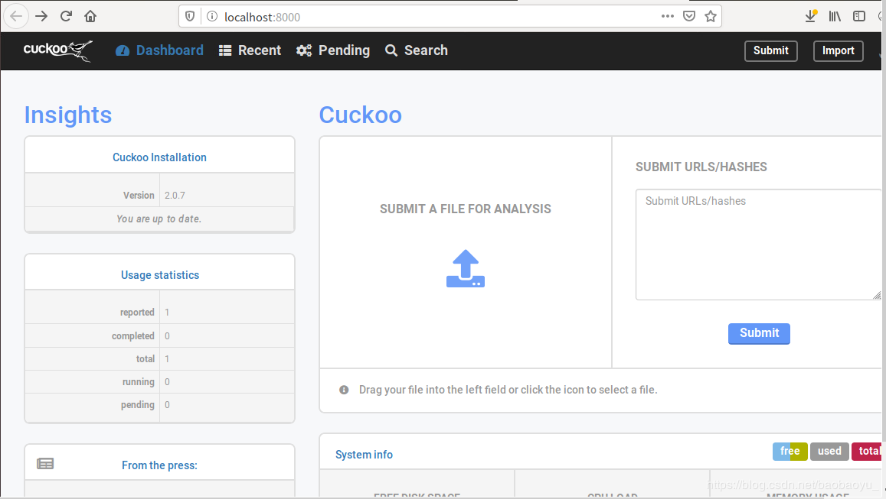
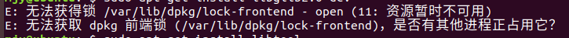
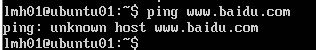
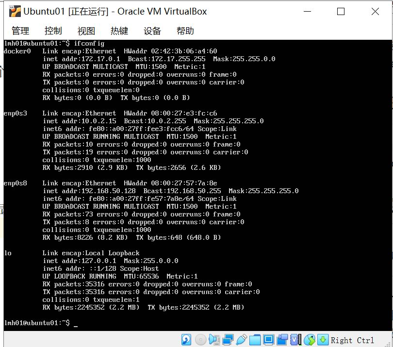

Cuckoo
---
## 实验要求：
- 安装并使用cuckoo，任意找一个程序，在cuckoo中trace获取软件行为的基本数据
## 实验环境：
- 主机：Ubuntu16.04
- 客机：Windows7
## 实验过程：
### 主机搭建Ubuntu
- 安装python2.7 cuckoo主要组件完全用python编写，需要安装python和一些软件包，但是他只支持python2.7
- 安装MongoDB 为了使用Django的web界面
- 安装虚拟化软件VirtualBox virtualbox最主要的作用是需要在里面搭建Windows 7虚拟机也就是客机
- 安装tcpdump 为了转储恶意软件在执行过程中执行的网络活动
- 安装Volatility cuckoo利用Volatility检查样本是否有使用逃避Cuckoo分析的rootkit技术
- 安装M2Crypto M2Crypto仅在安装了SWIG后才支持该库
- 安装Cuckoo  
    ```
    #新建用户
    sudo adduser cuckoo
    # 使新用户属于“vboxusers”组
    sudo usermod -a -G vboxusers cuckoo
    #在virtualenv中安装cuckoo
    $ virtualenv venv
    $ . venv/bin/activate
    (venv)$ pip install -U pip setuptools
    (venv)$ pip install -U cuckoo
    # 提高文件权限
    # 在venv中运行cuckoo
    cuckoo -d
    # 检查是否生成CWD文件 ，文件路径： /home/username(用户名)/.cuckoo/agent/agent.py 如果username下没有出现.cuckoo文件，可以使用快捷键ctrl+H显示隐藏文件
    ```
### 客机搭建 win7
- 先在ubuntu里的vbox中创建一个虚拟机，设定为Windows7 64位操作系统
- 关闭win7的防火墙、自动更新以及UAC
- 安装python2.7，并添加python路径到环境变量
- 安装PIL  
```
>cd C:\Python27\Scripts
>pip install Pillow
Collecting Pillow
  Downloading Pillow-4.3.0-cp27-cp27m-win32.whl (1.3MB
    100% |################################| 1.3MB 114k
Collecting olefile (from Pillow)
  Downloading olefile-0.44.zip (74kB)
    100% |################################| 81kB 145kB
Installing collected packages: olefile, Pillow
  Running setup.py install for olefile ... done
Successfully installed Pillow-4.3.0 olefile-0.44

```
- agent.py设置开机自启动
    - 将主机里找到的agent.py文件传给win7，并放进C:\Users\AppData\Roaming\MicroSoft\Windows\Start Menu\Programs\Startup\ 下，并把后缀名改为.pyw（user指用户名）
- 配置系统开机自动登录  
- 配置连接网络使主机客机可以相互通信
- 设置IP报文转发
```
$ sudo vim /etc/sysctl.conf
net.ipv4.ip_forward=1
sudo sysctl -p /etc/systl.conf
sudo iptables -A FORWARD -o eth0(ubuntu网卡名) -i vboxnet0 -s 192.168.56.0/24 -m conntrack --ctstate NEW -j ACCEPT
$ sudo iptables -A FORWARD -m conntrack --ctstate ESTABLISHED,RELATED -j ACCEPT
$ sudo iptables -A POSTROUTING -t nat -j MASQUERADE
$ sudo vim /etc/network/interfaces
# 文件下新增两行
pre-up iptables-restore < /etc/iptables.rules 
post-down iptables-save > /etc/iptables.rules
sudo apt-get install iptables=persistent
sudo netfilter-persistent save
$ sudo apt-get install -y dnsmasq
$ sudo service dnsmasq start
# 配置完成后win7中就可以联网了
```
 - 设置cuckoo配置文件
 ```
 $ vim virtualbox.conf
machines = cuckoo1 # 指定VirtualBox中Geust OS的虚拟机名称
[cuckoo1] 
label = cuckoo1  .
platform = windows
ip = 192.168.56.101 # 指定VirtualBox中Geust OS的IP位置
snapshot =snapshot
$ vim reporting.conf
[jsondump]
enabled = yes # no -> yes
indent = 4
calls = yes
[singlefile]
enabled = yes # no -> yes
html = yes # no -> yes
pdf = yes # no -> yes
[mongodb]
enabled = yes # no -> yes
host = 127.0.0.1
port = 27017
db = cuckoo
store_memdump = yes 
paginate = 100
version_check = no
machinery = virtualbox
memory_dump = yes
[resultserver]
ip = 192.168.56.1
port = 2042
 ```
 - 启动cuckoo服务
     - 在venv中，`cuckoo`启动cuckoo服务
     - 启动成功后，另外开出一个控制台，启动cuckoo web服务`cuckoo web`
     - 将启动成功所给出的网站，用浏览器打开即可得到搭建成功的cuckoo了，以下是搭建成功后的示意图：  
       
### 分析上传文件：
- 按照上图中的指示上传文件即可对文件进行分析
- Cuckoo 可以分析的文件类型包括但不限于：  
  * Windows 可执行文件
  * DLL 文件
  * PDF 文件
  * MS Office 文件
  * URL 和 HTML 文件
  * PHP 脚本文件
  * CPL 文件
  * VB 脚本文件
  * ZIP 压缩包
  * JAR 文件
  * Python 脚本文件
  * APK 文件
  * ELF 文件
     
## 实验中遇到的问题：
- 两个Ubuntu虚拟机，一个一直显示进程被占用，无法使用apt-get命令下载文件，一个在实验中一直解析不了域名，连不上网（做其他实验时不知道修改了什末，之前一直好好的，今天实验一直无法联网，重启修改均没有解决）  
  
  
  
- 尝试了以下办法，均以失败告终：  
- [E: 无法获得锁 /var/lib/dpkg/lock - open (11: 资源暂时不可用) E: 无法锁定管理目录(/var/lib/dpkg/)，是否有其他进程正占用它？](https://blog.csdn.net/maizousidemao/article/details/82252760) 
- [解决ubuntu16.04 ‘E: 无法获得锁 /var/lib/dpkg/lock-frontend - open (11: 资源暂时不可用) ’ 问题](https://blog.csdn.net/qq_38019633/article/details/84024309)
- [E: 无法获得锁 /var/lib/dpkg/lock-frontend - open (11: 资源暂时不可用) E: 无法获取 dpkg 前端锁 (/var/lib/dpkg/lock-front](https://blog.csdn.net/qq_41856814/article/details/101306701)
- [Linux不能上网ping:unknown host问题怎么解决？](https://jingyan.baidu.com/article/4d58d54137d2a19dd5e9c050.html)
- [ubuntu16.0.4bug无法解析域名](https://blog.csdn.net/weixin_44481878/article/details/88565884)
- [ubuntu网卡指定eth0及其它](https://blog.csdn.net/Lyanzh/article/details/76687017)
- 因此上述实验主要以讲述实验步骤为主，重在理解实验原理，参考资料为网上的cuckoo新手教程。
## 参考资料：
- [cuckoo环境搭建从零开始](https://blog.csdn.net/baobaoyu_/article/details/103047082)